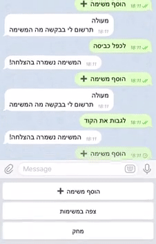

# Todo Chatbot

Simple Telegram chatbot for managing todos built with Claudia.js, Wit.ai, MongoDb

## How to run the bot?

1. Create Telegram bot with [@BotFather](https://core.telegram.org/bots#6-botfather) and copy the access token.
2. Install claudia.js and set your AWS credentials as described [here](https://claudiajs.com/tutorials/installing.html#configuring-access-credentials).
3. Run `npm run deploy` and paste your access key when claudia prompts you for it. Webhook URL will be set automatically.
4. Rename model/config.example.js to model/config.js and provide your MongoDb connection url and Wit.ai token.
5. Load the trained model zip to Wit.ai (witai-files/wit-ai-trained-todo-chatbot.zip)

## Demo

